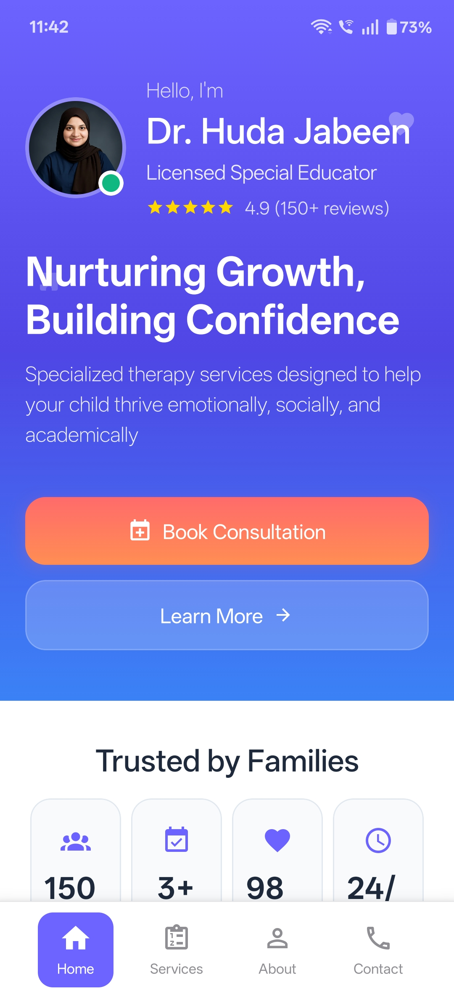
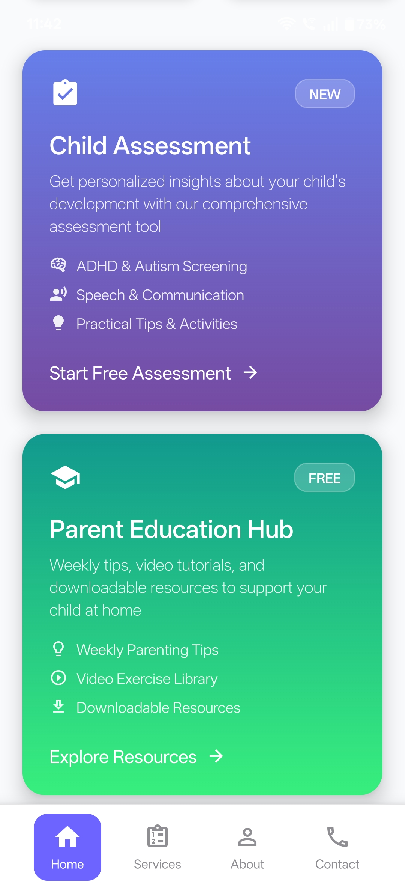
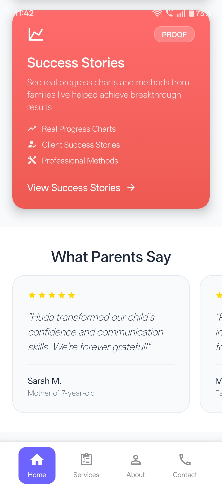
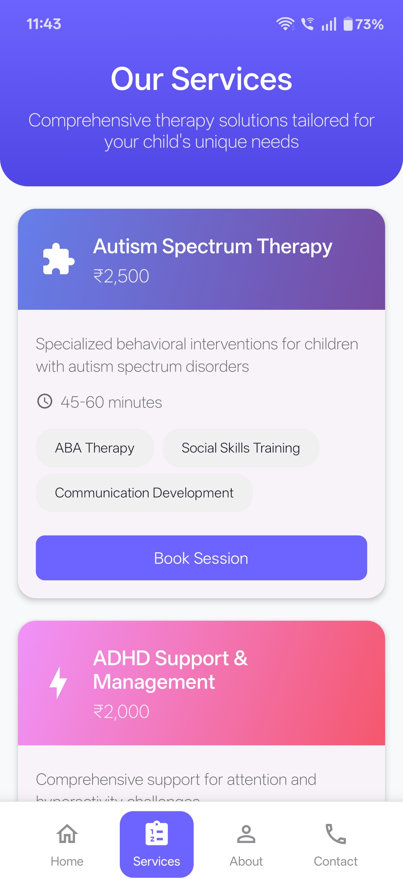
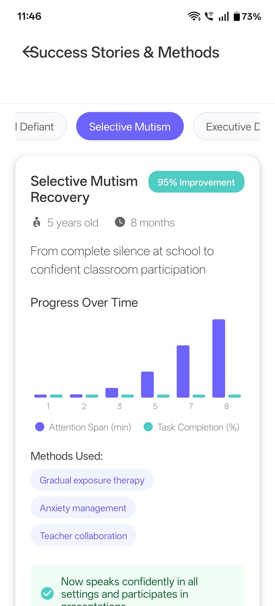

# Therapist Portfolio App


<p align="center">
   
   
   
   
   
</p>

<p align="center">
   <b>A sleek, mobile-friendly portfolio app for therapists and mental health professionals.</b><br>
   <i>Showcase expertise, build client trust, and enable easy booking — all in one place.</i><br>

</p>

<p align="center">
  <b>Contact on below email for Code and Collaboration, this App is not for free.</b><br>
   
</p>


<p align="center">
   <a href="#features"></a>
   <a href="LICENSE"></a>
   <a href="https://reactnative.dev/"></a>
   <a href="https://expo.dev/"></a>
</p>

---

<!-- <p align="center">
   
   
</p> -->

---

## 🚀 Why This App?

Therapists today need more than word of mouth — they need a **professional digital presence**.  
This app is designed to help you:  

- Present credentials & specializations in a polished way  
- List therapy services clearly with pricing & details  
- Allow clients to **book sessions effortlessly**  
- Share resources and assessments to add value  
- Build trust with testimonials & success stories  

This isn’t just an app template — it’s a **business growth tool** for modern therapists.

---

## ✨ Features

```text
🧑‍⚕️ Therapist Profile
   - Profile photo, bio, credentials, and specialties
   - Build trust and showcase expertise

🗂️ Services Showcase
   - List services with descriptions, pricing, and duration
   - Detailed view for in-depth information

📅 Booking & Contact
   - In-app booking request form with validation
   - Connect with email/calendar
   - Smooth animations for user engagement

📝 Assessments
   - Interactive self-assessment tools
   - Display results with insights and recommendations

📚 Education Hub
   - Curated articles, blogs, and videos
   - Organized for easy navigation

🌟 Success Stories
   - Client testimonials and progress stories
   - Build credibility with feedback highlights

🎬 Animated Onboarding & Splash
   - Branded splash screen with logo
   - Smooth onboarding walkthrough
   - Lottie animations for premium feel

```
---

## 🎯 ROI for Therapists

- **More Clients:** A professional mobile presence builds trust instantly  
- **Streamlined Workflow:** Central hub for services, resources, and contact  
- **Engagement:** Interactive assessments and educational content increase client value  
- **Customizable:** Adapt it easily for solo practices, clinics, or wellness centers  

---

## 🔧 Tech Behind the Scenes

Built with:  
- [React Native](https://reactnative.dev/) + [Expo](https://expo.dev/)  
- Lottie animations for a polished UX  
- React Navigation for smooth in-app journeys  

*(Technical details are hidden in the private repo — this public repo focuses on showcasing the product.)*

---

## 🛠️ Want This App for Your Practice?

This repo is a **showcase only**. If you’d like:  
- A **custom version with your branding**  
- Deployment to **App Store & Google Play**  
- Additional integrations (calendars, payment, CRM)  

👉 Reach out via **[Email](mailto:rahmansyed862@gmail.com)** or **[LinkedIn](https://www.linkedin.com/in/syedabdurrahmanuddin/)**  

---

## 📄 License

This project is licensed under the [MIT License](LICENSE).  

---

## 📬 Contact & Support

For inquiries regarding the **source code** or collaborations, feel free to reach out:

- **Email:** [rahmansyed862@gmail.com](mailto:rahmansyed862@gmail.com)  
- **Mobile / Whatsapp:** +91-8639279800
- **LinkedIn:** [Your LinkedIn Profile](https://www.linkedin.com/in/syedabdurrahmanuddin/)

